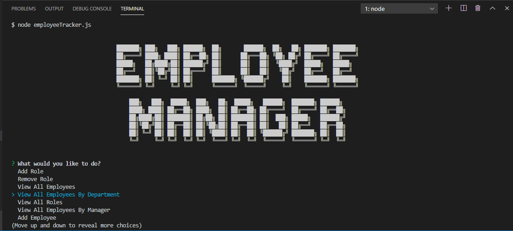

# My-SQL-Employee-Tracker

- [User Story](#User-Story)
- [General Info](#General-Info)
- [Instructions](#Instructions)
- [Motivation](#Motivation)
- [Future Functionality](#Future-Functionality)
- [References](#References)

## User Story

As a business owner
I want to be able to view and manage the departments, roles, and employees in my company
So that I can organize and plan my business

## General-Info

This application is an employee management tool, giving the user the ability to add, update, remove, change, and view aspects of their current company. Organization is a key component of this project which neatly displays information on each employee in a console.table. With an easy to use and interactive interface, this employee tracker makes a useful tool for company organization employing native JavaScript and My SQL databases.

## Instructions

To successfully run this application, the user should first clone the repository into a local file and run npm install. Using the local console, user will run "npm i" on the included dependencies such as "npm i express." After, running node employeetracker.js will trigger the server, bringing the user to the employee tracker "home menu" in node.

The user will then be able to select from a variety of options such as viewing all employees or updating a specificed role. All components will be displayed in the terminal, and after each menu selection the user will be brought back to the home menu.

## Motivation

This project gave me the opportunity to improve my skills on Node and Javascript which are both useful languages. We were newly introduced to databases through My SQL which became the cornerstone of this application. I enjoyed learning how to pair and join databases to output an organized result, pulling from multiple tables. Seeing how multiple programming languages can interact to create a seamless application was enjoyable and pertinent to our studies this past week.

## Future Functionality

I would like to include more working features on the Main Menu such as removing employees and viewing them by manager. The total future functionality can be seen in the switch/case section of the code, along with some commented out sections. I believe that as I get more practice with databases and joins, these now obstacles will become an integral part of this application.

## References

https://www.mysqltutorial.org/mysql-decimal/

https://www.w3schools.com/sql/sql_join.asp

https://medium.com/poka-techblog/
simplify-your-javascript-use-map-reduce-and-filter-bd02c593cc2d
